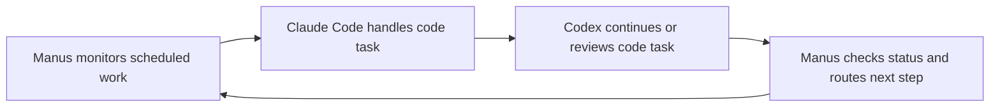

# ThinkRN Agent Workflow Reference

## What this is

This is a simple explanation of what happens when **Ray is away from the computer** and the system keeps working in the background.

The goal is straightforward: routine work keeps moving, but **important decisions still wait for Ray**.

## The big idea

Think of the system like a small remote team.

**One agent watches and runs the routine work.** Other coding agents help through GitHub when code needs to be written, checked, or cleaned up. If one agent stops because it runs out of room to keep going, the work is handed off so progress does not get lost.

## What Manus can do on its own

When Ray is not at the terminal, Manus can keep handling **scheduled and repeatable work**.

That can include things like checking whether a deployment is still live, reviewing incoming email for messages that matter, looking for updates that need attention, or checking Instagram workflows that have already been set up.

If the task is clear and already approved, Manus can keep doing it without waiting.

| Example job | What Manus does by itself | When it pauses |
|---|---|---|
| Deployment check | Opens the site, checks if it loads, and notes errors | If the fix needs a real product decision |
| Email review | Sorts messages, flags urgent ones, drafts responses | If Ray must approve the reply |
| Instagram workflow | Checks account activity or prepared publishing steps | If a post needs approval or sensitive action |
| Routine monitoring | Repeats the same checklist on a schedule | If something unusual happens |

## How Claude Code and Codex fit in

Claude Code and Codex are best understood as **coding specialists working through GitHub**.

They do not need to sit beside Ray. Instead, they can work on code branches, make commits, open pull requests, review changes, and leave notes for the next agent or for Ray.

That means the coding work has a paper trail.

| Tool | Simple role |
|---|---|
| Manus | Runs the overall workflow, watches systems, and decides what needs attention next |
| Claude Code | Helps write, improve, or review code in GitHub |
| Codex | Helps write, debug, or continue code work in GitHub |

## What “continue” and “deny” means

The approval model is simple.

Some tasks are safe enough to **continue automatically**. Other tasks are sensitive enough that they should **stop and wait**.

### Usually auto-approved

If the task is low-risk and already expected, the system can continue.

| Usually auto-approved | Why |
|---|---|
| Reading dashboards or logs | It does not change anything |
| Checking deployment status | It is just monitoring |
| Drafting code changes in GitHub | The work can still be reviewed before merge |
| Sorting or labeling messages | It is organizational, not final |
| Preparing drafts for posts or replies | Ray can still approve before sending |

### Usually waits for Ray

If the action could cause a visible, costly, or hard-to-undo result, the system should wait.

| Waits for Ray | Why |
|---|---|
| Sending a final public message | It affects real people directly |
| Publishing a post | It becomes public immediately |
| Merging a major pull request | It can change production behavior |
| Spending money or starting a paid service | It has financial impact |
| Approving a risky system change | It can break something important |

## How Ray gets notified

Ray should **not** get pinged for every small update.

The better model is quiet by default.

Ray only gets notified by **email** or **Telegram** when something important needs attention, such as:

| Notify Ray when | Example |
|---|---|
| A decision is needed | “Which version should go live?” |
| A risk appears | “The deployment is down.” |
| Approval is required | “This post is ready to publish.” |
| A handoff is needed | “Code is ready for final review.” |
| A blocker appears | “Login is required to continue.” |

## What happens if one AI runs out of tokens or context

The simple version is this: **the work should not disappear**.

If one coding agent runs out of room to keep going, the current state of work should be left in a place the next agent can pick up. In practice, that usually means GitHub commits, pull request notes, issue comments, branch history, logs, and short handoff summaries.

So instead of “starting over,” the next agent reads the latest work, understands what was already done, and continues from there.

| If this happens | Then the system does this |
|---|---|
| An agent hits its limit | It leaves notes and saves progress |
| Work is half-finished | Another agent picks it up from GitHub or the saved summary |
| A review is still needed | Ray is notified only if the review matters now |
| Nothing urgent is wrong | The rotation continues quietly |

## Simple agent rotation

Below is the basic idea of the rotation:

## What this means in plain English

When Ray steps away, the system can keep doing the **boring repeatable work**, keep code moving through GitHub, and stay quiet unless something truly needs a person.

The main rule is simple:

> **Routine work keeps moving. Important choices wait for Ray.**

That makes the system useful without becoming noisy or reckless.
